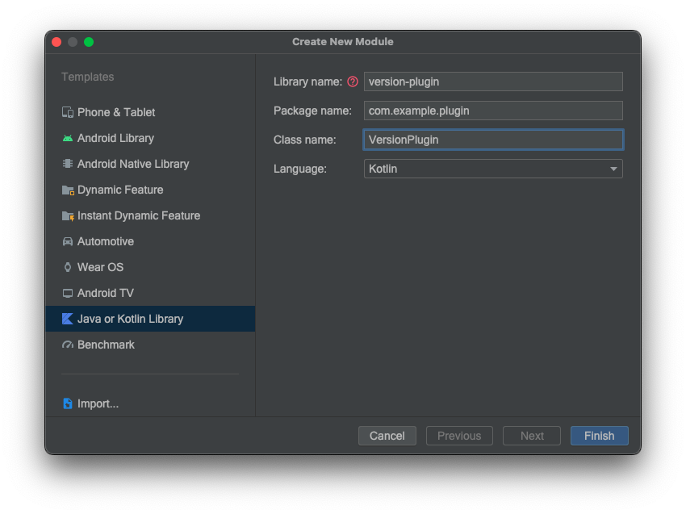
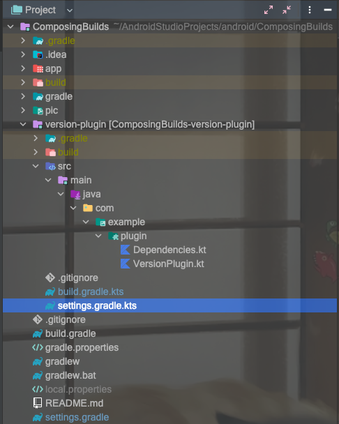

# 复合构建

## 为什么要使用复合构建

依赖管理一直是一个优化项目，从硬编码到`ext`，再发展到`buildSrc`，尽管代码量增长了，但是对于构建一直在追求更快更干净。`buildSrc`虽然给了我们 clean 的使用方式，但是 Gradle 最大的低效是它的单线程[配置阶段](https://docs.gradle.org/current/userguide/build_lifecycle.html#sec:build_phases)，这意味着每个额外的模块都会对构建产生持续的开销，因此我们依然经历着配置时间的线性增长，通常大型项目编译一次，要去喝杯咖啡。

使用 Gradle 的[复合构建工具](https://docs.gradle.org/current/userguide/composite_builds.html)就避免了在使用复合构建时很容易观察到的配置时间损失，依赖不再是全量编译了。复合构建将大型项目构建分解为更小、更独立的块，这些块可以根据需要独立或一起工作，包含的构建不与复合构建或其他包含的构建共享任何配置。每个包含的构建都是独立配置和执行的。

## 基本使用

### 创建版本依赖插件 Module

这个步骤可以手动创建，也可以借助 Android Studio 创建。

- #### 手动创建

    1. 切换到 Project 视图，创建 version-plugin 文件夹，在  version-plugin 文件夹里创建 src -> main -> java 文件

    2. 在 java 文件夹里创建你的包名文件夹，例如 com -> example -> plugin (不想要包名文件夹的话，这一步可以省略),在 plugin 文件夹里创建两个文件`Dependencies.kt`和`VersionPlugin.kt`

    3. 在 version-plugin 文件夹下创建`build.gradle.kts`文件，这里使用 kotlin DSL 更方便

    4. 在`build.gradle.kts`里添加所需的插件

       ```
       plugins {
           `kotlin-dsl`
       }
       ```

    5. 在version-plugin 根目录创建`settings.gradle.kts`,并添加依赖仓库

       ```
       dependencyResolutionManagement {
           repositories {
               google()
               mavenCentral()
           }
       }
       rootProject.name = "version-plugin"
       include (":version-plugin")
       ```


6. 在项目根目录的`settings.gradle`里添加`includeBuild("version-plugin")`引入插件

   ```
   pluginManagement {
       includeBuild("version-plugin")
       repositories {
           google()
           mavenCentral()
           gradlePluginPortal()
       }
   }
   dependencyResolutionManagement {
       repositoriesMode.set(RepositoriesMode.FAIL_ON_PROJECT_REPOS)
       repositories {
           google()
           mavenCentral()
       }
   }
   rootProject.name = "ComposeBuild"
   include ':app'
   ```


- #### AS创建

  

    1. File -> New -> New Module ,选择 `Java or kotlin Library`，创建一个 Module

    2. 创建`Dependencies.kt`文件

    3. 删除 version-plugin 文件夹下的 libs 文件夹

    4. 把`build.gradle`转化为`build.gradle.kts`文件

       ```
       plugins {
           `kotlin-dsl`
       }
       ```

    5. 在 version-plugin 根目录创建`settings.gradle.kts`,并添加依赖仓库

       ```
       dependencyResolutionManagement {
           repositories {
               google()
               mavenCentral()
           }
       }
       rootProject.name = "version-plugin"
       include (":version-plugin")
       ```

    6. 项目根目录`settings.gradle`里的`include ':version-plugin'`替换为`includeBuild("version-plugin")`,为了规范，把它注册在上面的`pluginManagement`里

       ```
       pluginManagement {
           includeBuild("version-plugin")
           repositories {
               google()
               mavenCentral()
               gradlePluginPortal()
           }
       }
       dependencyResolutionManagement {
           repositoriesMode.set(RepositoriesMode.FAIL_ON_PROJECT_REPOS)
           repositories {
               google()
               mavenCentral()
           }
       }
       rootProject.name = "ComposeBuild"
       include ':app'
       //include ':version-plugin'
       ```

       完成后的项目目录：



### 编写插件

Gradle 是一个框架，作为框架，它负责定义流程和规则。而具体的编译工作则是通过插件的方式来完成的，我们要引入插件，而达到获取插件配置的目的。

#### 实现插件类

在`VersionPlugin.kt`中实现插件

```
package com.example.plugin

import org.gradle.api.Plugin
import org.gradle.api.Project

class VersionPlugin : Plugin<Project> {
    override fun apply(target: Project) {
        println("VersionPlugin")
    }
}
```

#### 配置依赖

在`Dependencies.kt`中，我项目的依赖库拷贝在这里：

```
object Versions {
    const val composeUi = "1.3.1"
    const val composeVersion = "1.2.0"
    const val kotlin = "1.8.0"
    const val lifecycle = "2.5.1"
    const val activityCompose = "1.5.1"
    const val composeMaterial3 = "1.0.0-alpha11"
    const val junit = "4.13.2"
    const val androidxJunit = "1.1.3"
    const val espresso = "3.4.0"
}

object Libraries {
//    依赖库
    const val coreKtx = "androidx.core:core-ktx:${Versions.kotlin}"
    const val lifecycle = "androidx.lifecycle:lifecycle-runtime-ktx:${Versions.lifecycle}"
    const val activityCompose = "androidx.activity:activity-compose:${Versions.activityCompose}"
    const val composeUi = "androidx.compose.ui:ui:${Versions.composeUi}"
    const val composePreview = "androidx.compose.ui:ui-tooling-preview:${Versions.composeVersion}"
    const val composeMaterial3 = "androidx.compose.material3:material3:${Versions.composeMaterial3}"
//    测试库
    const val junit = "junit:junit:${Versions.junit}"
    const val androidxJunit = "androidx.test.ext:junit:${Versions.androidxJunit}"
    const val espresso = "androidx.test.espresso:espresso-core:${Versions.espresso}"
    const val uiTestJunit4 = "androidx.compose.ui:ui-test-junit4:${Versions.composeVersion}"
    const val uiTooling = "androidx.compose.ui:ui-tooling:${Versions.composeVersion}"
    const val uiTestManifest = "androidx.compose.ui:ui-test-manifest:${Versions.composeVersion}"

}
```

#### 注册插件

插件要能被别的 Module 引入，需要注册在插件 Module 的`build.gradle.kts`中

```
plugins {
    `kotlin-dsl`
}
gradlePlugin {
    plugins.register("versionPlugin") {
        id = "version-plugin"
        implementationClass = "com.example.plugin.VersionPlugin"
    }
}
```

### 使用

在用到的 Module 里添加插件，app 目录下的`build.gradle`：

```
plugins {
    id 'com.android.application'
    id 'org.jetbrains.kotlin.android'
    // 依赖插件
    id 'version-plugin'
}
```

这时候就可以引用插件 Module 里定义的依赖了：

```
implementation Libraries.coreKtx
```

## 扩展

### 依赖优化

上面一通操作，在使用的时候，并没有方便多少。为了不再一个一个的引入依赖，我们需要写个扩展优化。为了方便操作和提示，建议使用 Kotlin 的 DSL ，首先把`build.gradle`转为`build.gradle.kts`

转化前：

```
import com.example.plugin.Libraries

plugins {
    id 'com.android.application'
    id 'org.jetbrains.kotlin.android'
    id 'version-plugin'
}

android {
    namespace 'com.example.composingbuilds'
    compileSdk 33

    defaultConfig {
        applicationId "com.example.composingbuilds"
        minSdk 24
        targetSdk 33
        versionCode 1
        versionName "1.0"

        testInstrumentationRunner "androidx.test.runner.AndroidJUnitRunner"
        vectorDrawables {
            useSupportLibrary true
        }
    }

    buildTypes {
        release {
            minifyEnabled false
            proguardFiles getDefaultProguardFile('proguard-android-optimize.txt'), 'proguard-rules.pro'
        }
    }
    compileOptions {
        sourceCompatibility JavaVersion.VERSION_1_8
        targetCompatibility JavaVersion.VERSION_1_8
    }
    kotlinOptions {
        jvmTarget = '1.8'
    }
    buildFeatures {
        compose true
    }
    composeOptions {
        kotlinCompilerExtensionVersion '1.1.1'
    }
    packagingOptions {
        resources {
            excludes += '/META-INF/{AL2.0,LGPL2.1}'
        }
    }
}

dependencies {
    implementation Libraries.coreKtx
//    implementation 'androidx.core:core-ktx:1.7.0'
    implementation 'androidx.lifecycle:lifecycle-runtime-ktx:2.3.1'
    implementation 'androidx.activity:activity-compose:1.3.1'
    implementation "androidx.compose.ui:ui:$compose_version"
    implementation "androidx.compose.ui:ui-tooling-preview:$compose_version"
    implementation 'androidx.compose.material3:material3:1.0.0-alpha11'
    testImplementation 'junit:junit:4.13.2'
    androidTestImplementation 'androidx.test.ext:junit:1.1.3'
    androidTestImplementation 'androidx.test.espresso:espresso-core:3.4.0'
    androidTestImplementation "androidx.compose.ui:ui-test-junit4:$compose_version"
    debugImplementation "androidx.compose.ui:ui-tooling:$compose_version"
    debugImplementation "androidx.compose.ui:ui-test-manifest:$compose_version"
}
```

转化后：

```
import com.example.plugin.Libraries

plugins {
    id("com.android.application")
    id("kotlin-android")
    id("version-plugin")
}

android {
    namespace = "com.example.composingbuilds"
    compileSdk = 33

    defaultConfig {
        applicationId = "com.example.composingbuilds"
        minSdk = 23
        targetSdk = 33
        versionCode = 1
        versionName = "1.0"

        testInstrumentationRunner = "androidx.test.runner.AndroidJUnitRunner"
        vectorDrawables {
            useSupportLibrary = true
        }
    }

    buildTypes {
        getByName("release") {
            isMinifyEnabled = false
            proguardFiles(
                getDefaultProguardFile("proguard-android-optimize.txt"),
                "proguard-rules.pro"
            )
        }
    }
    compileOptions {
        sourceCompatibility = JavaVersion.VERSION_1_8
        targetCompatibility = JavaVersion.VERSION_1_8
    }
    kotlinOptions {
        jvmTarget = JavaVersion.VERSION_1_8.toString()
    }
    buildFeatures {
        compose = true
    }
    composeOptions {
        kotlinCompilerExtensionVersion = "1.1.1"
    }
    packagingOptions {
        resources {
            excludes += "/META-INF/{AL2.0,LGPL2.1}"
        }
    }
}

dependencies {
    implementation(Libraries.coreKtx)
    implementation(Libraries.lifecycle)
    implementation(Libraries.activityCompose)
    implementation(Libraries.composeUi)
    implementation(Libraries.composePreview)
    implementation(Libraries.composeMaterial3)

    testImplementation(Libraries.junit)
    androidTestImplementation(Libraries.androidxJunit)
    androidTestImplementation(Libraries.espresso)
    androidTestImplementation(Libraries.uiTestJunit4)
    debugImplementation(Libraries.uiTooling)
    debugImplementation(Libraries.uiTestManifest)

}
```

`dependencies`里面还是需要一个一个的依赖，有时候项目并不是一个 Module 而是多 Module 的状态，每个`build.gradle`都要写依赖，要简化这个繁琐的过程，就需要把依赖分类集中处理。

在插件 Module 里新建`Extension.kt`，可以把依赖库分为kotlin、android、compose、test四部分。扩展`DependencyHandlerScope`：

```
fun DependencyHandlerScope.kotlinProject() {
    "implementation"(Libraries.coreKtx)
}


fun DependencyHandlerScope.androidProject() {
    "implementation"(Libraries.lifecycle)
}

fun DependencyHandlerScope.composeProject() {
    "implementation"(Libraries.activityCompose)
    "implementation"(Libraries.composeUi)
    "implementation"(Libraries.composePreview)
    "implementation"(Libraries.composeMaterial3)
}

fun DependencyHandlerScope.androidTest() {
    "testImplementation"(Libraries.junit)
    "androidTestImplementation"(Libraries.androidxJunit)
    "androidTestImplementation"(Libraries.espresso)
    "androidTestImplementation"(Libraries.uiTestJunit4)
    "debugImplementation"(Libraries.uiTooling)
    "debugImplementation"(Libraries.uiTestManifest)
}
```

然后修改项目依赖,调用上面的扩展，短短几行就可实现：

```
dependencies {
    kotlinProject()
    androidProject()
    composeProject()
    androidTest()
    
//    implementation(Libraries.coreKtx)
//    implementation(Libraries.lifecycle)
//    implementation(Libraries.activityCompose)
//    implementation(Libraries.composeUi)
//    implementation(Libraries.composePreview)
//    implementation(Libraries.composeMaterial3)
//
//    testImplementation(Libraries.junit)
//    androidTestImplementation(Libraries.androidxJunit)
//    androidTestImplementation(Libraries.espresso)
//    androidTestImplementation(Libraries.uiTestJunit4)
//    debugImplementation(Libraries.uiTooling)
//    debugImplementation(Libraries.uiTestManifest)

}
```

### 插件依赖

上面只优化了`dependencies`这个闭包，`build.gradle.kts`依旧很多东西，既然写了一个插件，我们就用插件实现整个配置。

app的`build.gradle.kts`一共有三个闭包：`plugin`、`android`、 `dependencies`，对应插件其实也是现实这三个配置，回到最开始的`VersionPlugin`中：

```
class VersionPlugin : Plugin<Project> {
    override fun apply(target: Project) {
        with(target){
            //配置plugin
            //配置android
            //配置dependencies
        }
    }
}
```

#### 1. 首先实现配置`plugin`

这个闭包就是引入插件，把原 Module 用到的插件搬过来即可，这里要去掉原先加入的自身插件

```
//配置plugin
plugins.run {
    apply("com.android.application")
    apply("kotlin-android")
}
```

#### 2. 然后实现配置`android`

这里用到相关依赖，先添加到插件 Module 的`build.gradle.kts`里：

```
plugins {
    `kotlin-dsl`
}
dependencies {
    implementation("com.android.tools.build:gradle:7.3.1")
    implementation("org.jetbrains.kotlin:kotlin-gradle-plugin:1.8.0")
}
```

然后配置`android`，把 Module 的`build.gradle.kts`里的`android`部分搬过来，唯一需要注意的是，插件里没有`kotlinOptions`，需要自己写一个扩展：

```
//配置android
extensions.configure<ApplicationExtension> {
    applicationId = "com.asi.composingbuild"
    compileSdk=33
    defaultConfig {
        applicationId="com.asi.composingbuild"
        minSdk = 23
        targetSdk=33
        versionCode=1
        versionName="1.0"
        testInstrumentationRunner= "androidx.test.runner.AndroidJUnitRunner"
        vectorDrawables {
            useSupportLibrary =true
        }
    }
    buildTypes {
        getByName("release") {
            isMinifyEnabled = false
            proguardFiles(
                getDefaultProguardFile("proguard-android-optimize.txt"),
                "proguard-rules.pro"
            )
        }
    }
    compileOptions {
        sourceCompatibility = JavaVersion.VERSION_1_8
        targetCompatibility = JavaVersion.VERSION_1_8
    }

    kotlinOptions{
        jvmTarget = JavaVersion.VERSION_1_8.toString()
    }
    buildFeatures {
        compose = true
    }
    composeOptions {
        kotlinCompilerExtensionVersion = "1.1.1"
    }
    packagingOptions {
        resources {
            excludes += "/META-INF/{AL2.0,LGPL2.1}"
        }
    }
}
```

`kotlinOptions`扩展：

```
fun CommonExtension<*, *, *, *>.kotlinOptions(block: KotlinJvmOptions.() -> Unit) {
    (this as ExtensionAware).extensions.configure("kotlinOptions", block)
}
```

3. 首先实现配置`dependencies`

   ```
   //配置dependencies
   dependencies {
       kotlinProject()
       androidProject()
       composeProject()
       androidTest()
   }
   ```

    4. 依赖插件

       把 app Module 的`build.gradle.kts`里的内容都删了，只依赖下刚完成的插件：

       ```
       plugins {
           id("version-plugin")
       }
       ```

       是不是很清爽的感觉？

### 多个插件

如果是多 Module 的项目，每个 Module 的依赖会不一样，所以可以在 version-plugin 中编写多个`plugin`，然后注册`id`，在不同的 Module 里使用，修改某个依赖，只构建这个 Module 的依赖，达到隔离构建的目的。

## 复合构建

上面单一 Module 中单独的插件，依赖的库并没有达到隔离构建的目的，如果我们只是更改了`composeUi`版本，整个依赖都要重新编译。要实现隔离，需要更精细化的拆分，比如把`compose`部分单独出来。

新建一个`ComposePlugin.kt`,把原来插件中的关于`compose`的配置拷贝过来：

```
class ComposePlugin : Plugin<Project> {
    override fun apply(target: Project) {
        with(target) {
            //配置compose
            extensions.configure<ApplicationExtension> {
                buildFeatures {
                    compose = true
                }
                composeOptions {
                    kotlinCompilerExtensionVersion = Versions.kotlinCompilerExtensionVersion
                }
            }
            dependencies {
                composeProject()
            }
        }
    }
}
```

插件写完需要注册：

```
gradlePlugin {
    plugins.register("versionPlugin") {
        id = "version-plugin"
        implementationClass = "com.example.plugin.VersionPlugin"
    }
    plugins.register("ComposePlugin") {
        id = "compose-plugin"
        implementationClass = "com.example.plugin.ComposePlugin"
    }
}
```

这里可以优化下写法：

```
gradlePlugin {
    plugins{
        register("versionPlugin") {
            id = "version-plugin"
            implementationClass = "com.example.plugin.VersionPlugin"
        }
        register("ComposePlugin") {
            id = "compose-plugin"
            implementationClass = "com.example.plugin.ComposePlugin"
        }
    }
}
```

在 app 模块里引入：

```
plugins {
    id("version-plugin")
    id("compose-plugin")
}
```

这样如果修改`compose`版本，并不会构建别的依赖。

